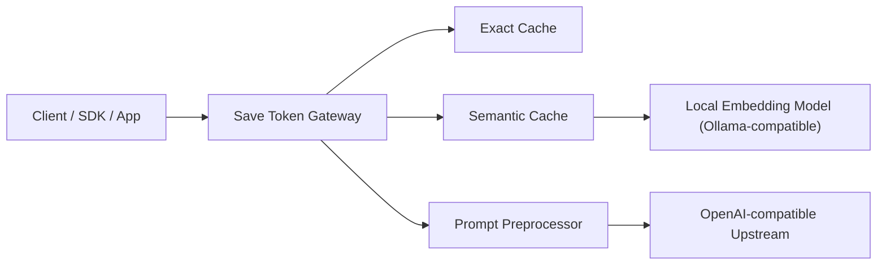

# Save Token Gateway

> A local, OpenAI-compatible gateway that reduces unnecessary token spend before requests reach your upstream model provider.

[](https://go.dev/)
[](./LICENSE)
[](https://github.com/slad-dev/save-token)

`Save Token Gateway` 是一个可本地运行的 OpenAI 兼容代理网关。

它不是另一个模型服务，而是放在你的客户端和上游 API 之间的一层“省钱代理”：

- 尽量复用已经问过的问题结果
- 尽量缩小不必要的输入体积
- 尽量避免模型无意义地长篇输出
- 尽量不改动你现有客户端的接入方式

如果你的应用已经支持 OpenAI 兼容接口，那么通常只需要把 `base_url` 改到本地网关，就可以开始接入。

## Why This Project

大多数 token 浪费，并不是因为模型本身，而是因为请求链路里存在很多可优化的地方：

- 同一个问题反复问，却每次都重新计费
- 对话越聊越长，历史消息不断膨胀
- 输入里混着大量无意义空白、注释、礼貌语和重复结构
- 用户只问一句短问题，但模型返回一大段不必要解释
- 多个客户端接入时，每个客户端都要单独实现“节省策略”

这个项目的目标，就是把这些优化集中放到一个本地网关层统一处理。

## Highlights

- OpenAI 兼容接口
  - 支持 `POST /v1/chat/completions`
  - 支持 `POST /chat/completions`
  - 支持 `POST /v1/embeddings`
  - 支持 `POST /embeddings`
  - 支持 `GET /v1/models`
  - 支持 `GET /models`
- 本地运行
  - Go 单文件服务，默认使用 SQLite 存储
  - 自带本地 Web UI，适合个人和小团队快速配置
- Token 节省策略
  - 精确缓存
  - 语义缓存
  - Prompt slimming
  - 滑窗裁剪
  - 激进模式输出约束
- 上游兼容
  - 面向 OpenAI-compatible upstream 设计
  - 可以对接官方 OpenAI，也可以对接兼容中转站或自建网关
- 可观测
  - 本地概览页可看请求数量、缓存命中、节省 token 等数据
  - 响应头会附带缓存命中和语义相似度观测信息

## Product Snapshot

本项目当前更适合以下场景：

- 你已经在使用 OpenAI 兼容 SDK，希望尽量少改业务代码
- 你想把“节省 token”的逻辑从网站后端剥离成一个本地程序
- 你需要一个有可视化配置界面的本地网关，而不是纯命令行代理
- 你希望为多个客户端统一提供相同的节省策略

不适合的场景：

- 你希望它替代完整的模型路由平台、团队级控制台或计费系统
- 你需要严格保证任何请求都不被改写
  - 此时应优先使用 `Conservative` 模式

## How It Works



处理流程大致如下：

1. 客户端继续按 OpenAI 兼容格式发请求
2. 网关先检查是否命中精确缓存
3. 未命中时，再尝试语义缓存
4. 如果仍需转发，则执行输入瘦身、前缀稳定化、滑窗裁剪等预处理
5. 最后再把优化后的请求转发到上游模型

## Strategy Modes

项目内置三档策略，适合不同风险偏好：

| 模式 | 适合场景 | 主要行为 |
| --- | --- | --- |
| `Conservative` | 对请求改写非常敏感 | 保守转发，保留稳定前缀，开启精确缓存 |
| `Balanced` | 日常默认推荐 | 在保守模式基础上加入语义缓存、基础瘦身、滑窗裁剪 |
| `Aggressive` | 优先追求节省效果 | 在平衡模式基础上加入更强输入压缩和更严格输出约束 |

建议：

- 第一次接入先用 `Balanced`
- 如果你依赖复杂工具调用、结构化消息或特殊上下文字段，先用 `Conservative`
- 如果你的主要流量是代码生成、长对话和重复问题，可进一步尝试 `Aggressive`

## Feature Matrix

| 能力 | 当前状态 | 说明 |
| --- | --- | --- |
| Exact cache | Yes | 相同请求直接复用结果 |
| Semantic cache | Yes | 基于本地 embedding 做语义命中 |
| Streaming passthrough | Yes | 支持流式透传 |
| Embeddings proxy | Yes | 支持 embeddings 转发 |
| Models proxy | Yes | 支持 models 查询 |
| Local Web UI | Yes | 支持配置、测试、概览 |
| SQLite persistence | Yes | 缓存、设置、日志本地持久化 |
| Docker deployment | Yes | 提供基础 Dockerfile |
| Multi-upstream routing | Partial | 项目有通用配置能力，本地模式默认走单上游 |

## Quick Start

### Option A: Run As A Local Desktop Gateway

适合“我只想本地跑一个节省 token 的程序，并通过网页配置”的使用方式。

1. 复制本地示例配置

```powershell
Copy-Item .\config.local.example.json .\config.json
```

2. 启动服务

```powershell
go run .\cmd\gateway
```

3. 打开本地配置页面

```text
http://127.0.0.1:8080
```

4. 在页面里填写

- 上游 `Base URL`
- 上游 `API Key`
- 节省策略

5. 让你的客户端改连本地网关

- 本地 `Base URL`：`http://127.0.0.1:8080`
- 本地 `API Key`：任意非空字符串即可

说明：

- 本地 `API Key` 只是为了兼容很多 OpenAI SDK 的必填校验
- 真正转发时，网关会使用你在本地页面中保存的上游 `API Key`

### Option B: Run As A General Gateway Service

适合你希望自己维护更完整配置、路由规则和上游列表的场景。

1. 复制通用配置

```powershell
Copy-Item .\config.json.example .\config.json
```

2. 编辑 `config.json`

3. 启动服务

```powershell
go run .\cmd\gateway
```

## Docker

```powershell
docker build -t save-token-gateway .
docker run --rm -p 8080:8080 -v ${PWD}/config.json:/app/config.json save-token-gateway
```

Docker 镜像默认使用 `/app/config.json` 作为配置文件路径。

## Example Client Usage

### Chat Completions

```bash
curl http://127.0.0.1:8080/v1/chat/completions \
  -H "Content-Type: application/json" \
  -H "Authorization: Bearer local-not-used" \
  -d '{
    "model": "gpt-5.4",
    "messages": [
      {"role": "user", "content": "请只回复 你好"}
    ]
  }'
```

### Embeddings

```bash
curl http://127.0.0.1:8080/v1/embeddings \
  -H "Content-Type: application/json" \
  -H "Authorization: Bearer local-not-used" \
  -d '{
    "model": "text-embedding-3-small",
    "input": "hello world"
  }'
```

## Configuration

### Core Files

- [`config.local.example.json`](./config.local.example.json)
  - 面向本地单机模式
  - 默认启用本地 Web UI
- [`config.json.example`](./config.json.example)
  - 面向通用服务模式
  - 更适合手工维护上游、模型路由和系统配置

### Semantic Cache

语义缓存默认面向 Ollama 兼容 embedding 接口，示例：

```json
{
  "cache": {
    "semantic_enabled": true,
    "semantic_similarity": 0.9,
    "semantic_embedding": {
      "provider": "ollama",
      "base_url": "http://127.0.0.1:11434",
      "model": "nomic-embed-text",
      "timeout": "15s"
    }
  }
}
```

如果本地 embedding 服务不可用，语义缓存不会正常命中。

## Project Structure

```text
cmd/gateway                 # 程序入口
internal/handler            # HTTP 接口、本地 UI、代理入口
internal/intelligent        # 预处理、压缩、语义提取、滑窗逻辑
internal/cache              # 精确缓存与语义缓存
internal/localapp           # 本地模式配置与概览服务
internal/gateway            # 上游代理与路由注册
internal/store              # SQLite 存储实现
```

## Local UI

本地 UI 的目标不是做完整管理后台，而是提供一个“开箱即用、适合个人测试和本地运行”的控制面板。当前包括：

- 上游配置
- 策略切换
- 连接测试
- 运行概览
- 最近请求记录
- 本地调用示例

## Observability

为了帮助你判断节省策略是否生效，网关会在响应头附带部分观测信息，例如：

- `X-SaveToken-Cache`
- `X-SaveToken-Semantic-Score`
- `X-SaveToken-Semantic-Threshold`

你也可以通过本地概览页查看整体命中情况与节省统计。

## Development

### Run Tests

```powershell
go test ./...
```

### Build Binary

```powershell
go build -o save-token.exe .\cmd\gateway
```

## Security Notes

请不要把以下内容提交到公开仓库：

- 真实 `config.json`
- 数据库文件
- 日志文件
- 编译产物
- 任何真实 API Key、Cookie、OAuth Secret、SMTP 密码

当前仓库已通过 [`.gitignore`](./.gitignore) 排除这些运行时文件，但发布前仍建议人工复查。

## Roadmap Ideas

以下方向很适合后续继续演进：

- 更细粒度的节省效果可视化
- 更稳的语义相似度调试与阈值观测
- 更完整的模型与上游能力探测
- 更成熟的桌面分发形态
- 更严格的隐私与策略控制开关

## Contributing

欢迎 issue、建议、PR 和可复现的优化案例。

如果你准备贡献代码，建议优先带上以下信息：

- 复现场景
- 预期节省效果
- 上游类型与模型
- 是否为流式请求
- 是否涉及工具调用或结构化输出

## License

本项目使用 [MIT License](./LICENSE)。
